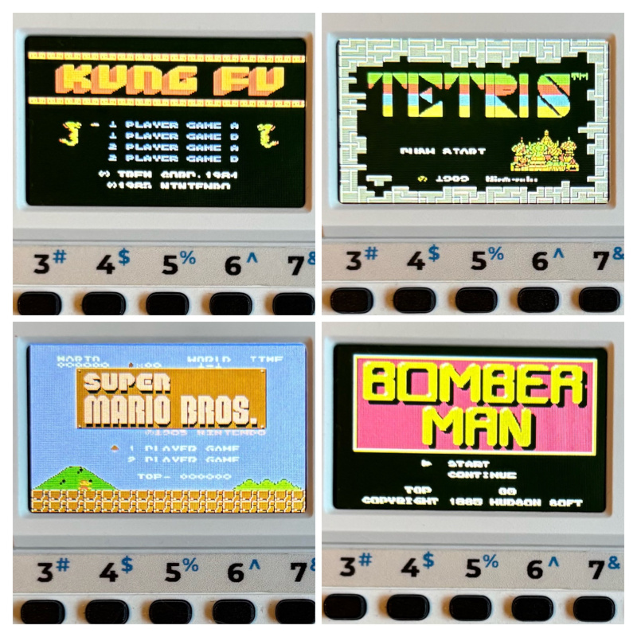

# NES Emulator for M5Stack Cardputer

Powered by [Nofrendo](https://github.com/moononournation/arduino-nofrendo). **A full-speed NES emulator running on the M5Stack Cardputer**, with sound, video, and gamepad controls.

It runs **.nes ROM files directly from the SD**, simply browse and select the game you want to play.
**Make sure your ROMs are uncompressed** (.nes only — not .zip, .7z, or .rar).
## Controls

The built-in **Cardputer keyboard** is used for all NES controls: 

| NES Function | Cardputer Key | Description |
|---------------|---------------|-------------|
| 🕹️ Up | **E** | Move up |
| 🕹️ Down | **S** | Move down |
| 🕹️ Left | **A** | Move left |
| 🕹️ Right | **D** | Move right |
| 🅰️ Button A | **K** | Primary action / confirm |
| 🅱️ Button B | **L** | Secondary action / cancel |
| ▶️ Start | **1** | Start / pause |
| ⏸️ Select | **2** | Select / menu |
| 💡 Brightness + | **]** | Increase LCD brightness |
| 💡 Brightness − | **[** | Decrease LCD brightness |
| 🔊 Volume + | **+** | Increase audio volume |
| 🔊 Volume − | **-** | Decrease audio volume |

## Games Supported

| Title                                                        | Region         |   Mapper |
|:-------------------------------------------------------------|:---------------|---------:|
| 10-Yard Fight                                                | Japan          |        0 |
| 10-Yard Fight                                                | USA            |        0 |
| 1942                                                         | Japan          |        0 |
| 1942                                                         | USA            |        0 |
| 4-nin Uchi Mahjong                                           | Japan          |        0 |
| Antarctic Adventure                                          | Japan          |        0 |
| Astro Robo SASA                                              | Japan          |        0 |
| Balloon Fight                                                | Europe         |        0 |
| Balloon Fight                                                | Japan          |        0 |
| Balloon Fight                                                | USA            |        0 |
| Baltron                                                      | Japan          |        0 |
| Baseball                                                     | Japan          |        0 |
| Baseball                                                     | Spain          |        0 |
| Baseball                                                     | USA            |        0 |
| Baseball                                                     | United Kingdom |        0 |
| Battle City                                                  | Japan          |        0 |
| Binary Land                                                  | Japan          |        0 |
| Block Set                                                    | Japan          |        0 |
| Bokosuka Wars                                                | Japan          |        0 |
| Bomberman                                                    | Japan          |        0 |
| Bomberman                                                    | USA            |        0 |
| BurgerTime                                                   | Japan          |        0 |
| BurgerTime                                                   | USA            |        0 |
| Chack 'n Pop                                                 | Japan          |        0 |
| Challenger                                                   | Japan          |        0 |
| Championship Lode Runner                                     | Japan          |        0 |
| Choujikuu Yousai Macross                                     | Japan          |        0 |
| Chubby Cherub                                                | USA            |        0 |
| Circus Charlie                                               | Japan          |        0 |
| Clu Clu Land                                                 | Europe         |        0 |
| Clu Clu Land                                                 | France         |        0 |
| Clu Clu Land                                                 | Japan          |        0 |
| Clu Clu Land                                                 | USA            |        0 |
| Defender II                                                  | USA            |        0 |
| Devil World                                                  | Europe         |        0 |
| Devil World                                                  | Japan          |        0 |
| Dig Dug                                                      | Japan          |        0 |
| Dig Dug II                                                   | Japan          |        0 |
| Dig Dug II: Trouble in Paradise                              | USA            |        0 |
| Donkey Kong                                                  | Europe         |        0 |
| Donkey Kong                                                  | Japan          |        0 |
| Donkey Kong                                                  | USA            |        0 |
| Donkey Kong 3                                                | Japan          |        0 |
| Donkey Kong 3                                                | USA            |        0 |
| Donkey Kong 3                                                | United Kingdom |        0 |
| Donkey Kong Jr.                                              | Europe         |        0 |
| Donkey Kong Jr.                                              | Japan          |        0 |
| Donkey Kong Jr.                                              | USA            |        0 |
| Donkey Kong Jr. / Jr. Sansuu Lesson                          | Japan          |        0 |
| Donkey Kong Jr. Math                                         | Europe         |        0 |
| Donkey Kong Jr. Math                                         | USA            |        0 |
| Donkey Kong Jr. no Sansuu Asobi                              | Japan          |        0 |
| Door Door                                                    | Japan          |        0 |
| Dough Boy                                                    | Japan          |        0 |
| Duck Hunt                                                    | Canada         |        0 |
| Duck Hunt                                                    | Europe         |        0 |
| Duck Hunt                                                    | Japan          |        0 |
| Duck Hunt                                                    | Spain          |        0 |
| Duck Hunt                                                    | USA            |        0 |
| Elevator Action                                              | Japan          |        0 |
| Elevator Action                                              | USA            |        0 |
| Excitebike                                                   | Europe         |        0 |
| Excitebike                                                   | Germany        |        0 |
| Excitebike                                                   | Japan          |        0 |
| Excitebike                                                   | Spain          |        0 |
| Excitebike                                                   | USA            |        0 |
| Exed Exes                                                    | Japan          |        0 |
| Exerion                                                      | Japan          |        0 |
| F1 Race                                                      | Japan          |        0 |
| Family BASIC                                                 | Japan          |        0 |
| Family BASIC v3.0                                            | Japan          |        0 |
| Field Combat                                                 | Japan          |        0 |
| Flappy                                                       | Japan          |        0 |
| Formation Z                                                  | Japan          |        0 |
| Front Line                                                   | Japan          |        0 |
| Galaga                                                       | Japan          |        0 |
| Galaga: Demons of Death                                      | Europe         |        0 |
| Galaga: Demons of Death                                      | USA            |        0 |
| Galaxian                                                     | Japan          |        0 |
| Game Genie                                                   | USA            |        0 |
| Geimos                                                       | Japan          |        0 |
| Golf                                                         | Canada         |        0 |
| Golf                                                         | Europe         |        0 |
| Golf                                                         | France         |        0 |
| Golf                                                         | Japan          |        0 |
| Golf                                                         | Spain          |        0 |
| Golf                                                         | USA            |        0 |
| Gomoku Narabe Renju                                          | Japan          |        0 |
| Gyro                                                         | Japan          |        0 |
| Gyrodine                                                     | Japan          |        0 |
| Gyromite                                                     | Canada         |        0 |
| Gyromite                                                     | France         |        0 |
| Gyromite                                                     | USA            |        0 |
| Gyromite                                                     | United Kingdom |        0 |
| Hidden Chinese Chess                                         | Taiwan         |        0 |
| Hogan's Alley                                                | Europe         |        0 |
| Hogan's Alley                                                | Japan          |        0 |
| Hogan's Alley                                                | USA            |        0 |
| Hon Shougi: Naitou 9 Dan Shougi Hiden                        | Japan          |        0 |
| Hydlide                                                      | USA            |        0 |
| Hydlide Special                                              | Japan          |        0 |
| Hyper Olympic                                                | Japan          |        0 |
| Hyper Sports                                                 | Japan          |        0 |
| Ice Climber                                                  | Europe         |        0 |
| Ice Climber                                                  | Japan          |        0 |
| Ice Climber                                                  | Spain          |        0 |
| Ice Climber                                                  | USA            |        0 |
| Ice Hockey                                                   | Europe         |        0 |
| Ice Hockey                                                   | Spain          |        0 |
| Ice Hockey                                                   | USA            |        0 |
| Ikki                                                         | Japan          |        0 |
| Karateka                                                     | Japan          |        0 |
| Kinnikuman: MUSCLE Tag Match                                 | Japan          |        0 |
| Kung Fu                                                      | Europe         |        0 |
| Kung Fu                                                      | Germany        |        0 |
| Kung Fu                                                      | Spain          |        0 |
| Kung Fu                                                      | USA            |        0 |
| Kung Fu                                                      | United Kingdom |        0 |
| Lode Runner                                                  | Japan          |        0 |
| Lode Runner                                                  | USA            |        0 |
| Lot Lot                                                      | Japan          |        0 |
| Lunar Ball                                                   | Japan          |        0 |
| Lunar Pool                                                   | France         |        0 |
| Lunar Pool                                                   | USA            |        0 |
| Lunar Pool                                                   | United Kingdom |        0 |
| M.U.S.C.L.E.: Tag Team Match                                 | USA            |        0 |
| Mach Rider                                                   | Japan          |        0 |
| Mario Bros.                                                  | Canada         |        0 |
| Mario Bros.                                                  | Europe         |        0 |
| Mario Bros.                                                  | Germany        |        0 |
| Mario Bros.                                                  | Japan          |        0 |
| Mario Bros.                                                  | USA            |        0 |
| Millipede                                                    | USA            |        0 |
| Ms. Pac-Man                                                  | USA            |        0 |
| Ninja Hattori-kun: Ninja wa Shuugyou de Gozaru no Maki       | Japan          |        0 |
| Ninja-kun: Majou no Bouken                                   | Japan          |        0 |
| Nuts & Milk                                                  | Japan          |        0 |
| Obake no Q Tarou: Wanwan Panic                               | Japan          |        0 |
| Onyanko Town                                                 | Japan          |        0 |
| Othello                                                      | USA            |        0 |
| Pac-Land                                                     | Japan          |        0 |
| Pac-Man                                                      | Japan          |        0 |
| Pac-Man                                                      | USA            |        0 |
| Pachi Com                                                    | Japan          |        0 |
| Penguin-kun Wars                                             | Japan          |        0 |
| Pinball                                                      | Canada         |        0 |
| Pinball                                                      | Europe         |        0 |
| Pinball                                                      | Germany        |        0 |
| Pinball                                                      | Japan          |        0 |
| Pinball                                                      | Spain          |        0 |
| Pinball                                                      | USA            |        0 |
| Playbox BASIC                                                | Japan          |        0 |
| Pooyan                                                       | Japan          |        0 |
| Popeye                                                       | Europe         |        0 |
| Popeye                                                       | France         |        0 |
| Popeye                                                       | Japan          |        0 |
| Popeye                                                       | Spain          |        0 |
| Popeye                                                       | USA            |        0 |
| Popeye no Eigo Asobi                                         | Japan          |        0 |
| Portopia Renzoku Satsujin Jiken                              | Japan          |        0 |
| Raid on Bungeling Bay                                        | Japan          |        0 |
| Raid on Bungeling Bay                                        | USA            |        0 |
| Road Fighter                                                 | Australia      |        0 |
| Road Fighter                                                 | Germany        |        0 |
| Road Fighter                                                 | Japan          |        0 |
| Road Fighter                                                 | Scandinavia    |        0 |
| Road Fighter                                                 | Spain          |        0 |
| Route 16 Turbo                                               | Japan          |        0 |
| Seicross                                                     | Japan          |        0 |
| Seicross                                                     | USA            |        0 |
| Sky Destroyer                                                | Japan          |        0 |
| Slalom                                                       | Europe         |        0 |
| Slalom                                                       | USA            |        0 |
| Soccer                                                       | Canada         |        0 |
| Soccer                                                       | Europe         |        0 |
| Soccer                                                       | Germany        |        0 |
| Soccer                                                       | Japan          |        0 |
| Soccer                                                       | Spain          |        0 |
| Soccer                                                       | USA            |        0 |
| Son Son                                                      | Japan          |        0 |
| Space Invaders                                               | Japan          |        0 |
| Spartan X                                                    | Japan          |        0 |
| Spelunker                                                    | Japan          |        0 |
| Spelunker                                                    | USA            |        0 |
| Spy vs. Spy                                                  | Europe         |        0 |
| Spy vs. Spy                                                  | USA            |        0 |
| Sqoon                                                        | Japan          |        0 |
| Sqoon                                                        | USA            |        0 |
| Stack-Up                                                     | France         |        0 |
| Stack-Up                                                     | USA            |        0 |
| Star Force                                                   | Japan          |        0 |
| Star Gate                                                    | Japan          |        0 |
| Star Luster                                                  | Japan          |        0 |
| Super Arabian                                                | Japan          |        0 |
| Super Mario Bros.                                            | Europe         |        0 |
| Super Mario Bros.                                            | Germany        |        0 |
| Super Mario Bros.                                            | Japan          |        0 |
| Super Mario Bros.                                            | Scandinavia    |        0 |
| Super Mario Bros.                                            | Spain          |        0 |
| Super Mario Bros.                                            | USA            |        0 |
| Super Mario Bros.                                            | United Kingdom |        0 |
| Tag Team Pro-Wrestling                                       | Japan          |        0 |
| Tag Team Wrestling                                           | USA            |        0 |
| Tennis                                                       | Europe         |        0 |
| Tennis                                                       | Japan          |        0 |
| Tennis                                                       | Spain          |        0 |
| Tennis                                                       | USA            |        0 |
| Thexder                                                      | Japan          |        0 |
| Tower of Druaga, The                                         | Japan          |        0 |
| Urban Champion                                               | Canada         |        0 |
| Urban Champion                                               | France         |        0 |
| Urban Champion                                               | Japan          |        0 |
| Urban Champion                                               | USA            |        0 |
| Virus                                                        | USA            |        0 |
| Volguard II                                                  | Japan          |        0 |
| Volleyball                                                   | Europe         |        0 |
| Volleyball                                                   | France         |        0 |
| Volleyball                                                   | USA            |        0 |
| Warpman                                                      | Japan          |        0 |
| Wild Gunman                                                  | Europe         |        0 |
| Wild Gunman                                                  | Japan          |        0 |
| Wild Gunman                                                  | Spain          |        0 |
| Wild Gunman                                                  | USA            |        0 |
| Wrecking Crew                                                | Canada         |        0 |
| Wrecking Crew                                                | Europe         |        0 |
| Wrecking Crew                                                | Japan          |        0 |
| Wrecking Crew                                                | Spain          |        0 |
| Wrecking Crew                                                | USA            |        0 |
| Xevious                                                      | Europe         |        0 |
| Xevious                                                      | Japan          |        0 |
| Xevious: The Avenger                                         | USA            |        0 |
| Yie Ar Kung Fu                                               | Japan          |        0 |
| Zippy Race                                                   | Japan          |        0 |
| Zunou Senkan Galg                                            | Japan          |        0 |
| ASO: Armored Scrum Object                                    | Japan          |        3 |
| Adan y Eva                                                   | Spain          |        3 |
| Adventure Island                                             | USA            |        3 |
| Adventure Island Classic                                     | Germany        |        3 |
| Adventure Island Classic                                     | Spain          |        3 |
| Adventures of Dino Riki                                      | USA            |        3 |
| Alpha Mission                                                | Europe         |        3 |
| Alpha Mission                                                | USA            |        3 |
| Arkanoid                                                     | Japan          |        3 |
| Arkanoid                                                     | USA            |        3 |
| Arkista's Ring                                               | USA            |        3 |
| Athletic World                                               | Europe         |        3 |
| Athletic World                                               | Italy          |        3 |
| Athletic World                                               | USA            |        3 |
| Back to the Future                                           | USA            |        3 |
| Banana                                                       | Japan          |        3 |
| Bandai Golf: Challenge Pebble Beach                          | USA            |        3 |
| Battle Tank, Garry Kitchen's                                 | USA            |        3 |
| Battleship                                                   | Germany        |        3 |
| Battleship                                                   | USA            |        3 |
| Booky Man                                                    | Spain          |        3 |
| Bubble Bath Babes                                            | USA            |        3 |
| Buggy Popper                                                 | Japan          |        3 |
| Bump 'n' Jump                                                | USA            |        3 |
| Cadillac                                                     | Japan          |        3 |
| Castle Excellent                                             | Japan          |        3 |
| Castlequest                                                  | USA            |        3 |
| Championship Bowling                                         | Japan          |        3 |
| Championship Bowling                                         | USA            |        3 |
| City Connection                                              | Spain          |        3 |
| City Connection                                              | USA            |        3 |
| Corre Benny                                                  | Spain          |        3 |
| Cosmo Genesis                                                | Japan          |        3 |
| Cosmos Cop                                                   | Spain          |        3 |
| Cybernoid: The Fighting Machine                              | USA            |        3 |
| Dash Galaxy in the Alien Asylum                              | USA            |        3 |
| Destination Earthstar                                        | USA            |        3 |
| Donkey Kong Classics                                         | Europe         |        3 |
| Donkey Kong Classics                                         | Germany        |        3 |
| Donkey Kong Classics                                         | Spain          |        3 |
| Donkey Kong Classics                                         | USA            |        3 |
| Donkey Kong Classics                                         | United Kingdom |        3 |
| Dragon Quest                                                 | Japan          |        3 |
| Drop Zone                                                    | Germany        |        3 |
| Dynamite Bowl                                                | Japan          |        3 |
| Egypt                                                        | Japan          |        3 |
| El Destructor                                                | Spain          |        3 |
| El Monstruo de los Globos                                    | Spain          |        3 |
| Exploding Fist                                               | USA            |        3 |
| Family Trainer 1: Athletic World                             | Japan          |        3 |
| Family Trainer 2: Running Stadium                            | Japan          |        3 |
| Family Trainer 3: Aerobics Studio                            | Japan          |        3 |
| Family Trainer 4: Jogging Race                               | Japan          |        3 |
| Family Trainer 7: Famitre Daiundoukai                        | Japan          |        3 |
| Family Trainer 8: Totsugeki! Fuun Takeshijou                 | Japan          |        3 |
| Fisher-Price: Firehouse Rescue                               | USA            |        3 |
| Fisher-Price: I Can Remember                                 | USA            |        3 |
| Fisher-Price: Perfect Fit                                    | USA            |        3 |
| Fleet Commander                                              | Japan          |        3 |
| Flipull: An Exciting Cube Game                               | Japan          |        3 |
| Friday the 13th                                              | USA            |        3 |
| Ganso Saiyuuki Super Monkey Daibouken                        | Japan          |        3 |
| GeGeGe no Kitarou: Youkai Daimakyou                          | Japan          |        3 |
| Ghostbusters                                                 | Japan          |        3 |
| Ghostbusters                                                 | USA            |        3 |
| Gorby no Pipeline Daisakusen                                 | Japan          |        3 |
| Gotcha! The Sport!                                           | USA            |        3 |
| Gradius                                                      | Europe         |        3 |
| Gradius                                                      | Germany        |        3 |
| Gradius                                                      | Japan          |        3 |
| Gradius                                                      | USA            |        3 |
| Gyruss                                                       | USA            |        3 |
| Hayauchi Super Igo                                           | Japan          |        3 |
| Hello Kitty no Ohanabatake                                   | Japan          |        3 |
| Hokuto no Ken                                                | Japan          |        3 |
| Hottaaman no Chitei Tanken                                   | Japan          |        3 |
| Ikinari Musician                                             | Japan          |        3 |
| Jaws                                                         | USA            |        3 |
| John Elway's Quarterback                                     | USA            |        3 |
| Joust                                                        | USA            |        3 |
| Karate Champ                                                 | USA            |        3 |
| Karate Kid, The                                              | USA            |        3 |
| Kero Kero Keroppi no Daibouken                               | Japan          |        3 |
| King's Knight                                                | Japan          |        3 |
| King's Knight                                                | USA            |        3 |
| Kings of the Beach                                           | USA            |        3 |
| Kung-Fu Heroes                                               | USA            |        3 |
| Last Starfighter, The                                        | USA            |        3 |
| Legend of Kage, The                                          | USA            |        3 |
| Major League Baseball                                        | USA            |        3 |
| Meikyuu Kumikyoku: Milon no Daibouken                        | Japan          |        3 |
| Mickey Mouse: Fushigi no Kuni no Daibouken                   | Japan          |        3 |
| Mickey Mousecapade                                           | USA            |        3 |
| Mighty Bomb Jack                                             | Spain          |        3 |
| Mighty Bomb Jack                                             | USA            |        3 |
| Milon's Secret Castle                                        | USA            |        3 |
| Minna no Taabou no Nakayoshi Daisakusen                      | Japan          |        3 |
| Monster Truck Rally                                          | USA            |        3 |
| Musashi no Ken: Tadaima Shugyou Chuu                         | Japan          |        3 |
| Mystery Quest                                                | USA            |        3 |
| Nagagutsu o Haita Neko: Sekai Isshuu 80-nichi Daibouken      | Japan          |        3 |
| Ninja Kid                                                    | USA            |        3 |
| Paperboy                                                     | Europe         |        3 |
| Paperboy                                                     | Germany        |        3 |
| Paperboy                                                     | Japan          |        3 |
| Paperboy                                                     | Scandinavia    |        3 |
| Paperboy                                                     | USA            |        3 |
| Peepar Time                                                  | Japan          |        3 |
| Pipe Dream                                                   | USA            |        3 |
| Power Soccer                                                 | Japan          |        3 |
| Puzznic                                                      | Europe         |        3 |
| Puzznic                                                      | Germany        |        3 |
| Puzznic                                                      | USA            |        3 |
| Q*bert                                                       | USA            |        3 |
| Quarth                                                       | Japan          |        3 |
| Sanrio Carnival                                              | Japan          |        3 |
| Sanrio Carnival 2                                            | Japan          |        3 |
| Sanrio Cup: Pon Pon Volley                                   | Japan          |        3 |
| Sansuu 4 Nen: Keisan Game                                    | Japan          |        3 |
| Seikima II: Akuma no Gyakushuu                               | Japan          |        3 |
| Shin Jinrui: The New Type                                    | Japan          |        3 |
| Shooting Range                                               | USA            |        3 |
| Skate Boy                                                    | Spain          |        3 |
| Solomon no Kagi                                              | Japan          |        3 |
| Solomon's Key                                                | Europe         |        3 |
| Solomon's Key                                                | Spain          |        3 |
| Solomon's Key                                                | USA            |        3 |
| Space Hunter                                                 | Japan          |        3 |
| Spy Hunter                                                   | USA            |        3 |
| Stadium Events                                               | Europe         |        3 |
| Stadium Events                                               | USA            |        3 |
| Star Force                                                   | Europe         |        3 |
| Star Force                                                   | USA            |        3 |
| Star Soldier                                                 | Japan          |        3 |
| Star Soldier                                                 | USA            |        3 |
| Star Voyager                                                 | USA            |        3 |
| Super Mogura Tataki!! Pokkun Moguraa                         | Japan          |        3 |
| Super Team Games                                             | USA            |        3 |
| T&C Surf Designs: Wood and Water Rage                        | USA            |        3 |
| Takahashi Meijin no Boukenjima                               | Japan          |        3 |
| Tatakae! Chou Robotto Seimeitai Transformers: Convoy no Nazo | Japan          |        3 |
| Tetris                                                       | Japan          |        3 |
| Tetris                                                       | USA            |        3 |
| Tetsudou Ou                                                  | Japan          |        3 |
| Tiger-Heli                                                   | Europe         |        3 |
| Tiger-Heli                                                   | Japan          |        3 |
| Tiger-Heli                                                   | USA            |        3 |
| Tokoro-san no Mamoru mo Semeru mo                            | Japan          |        3 |
| Track & Field                                                | USA            |        3 |
| Track & Field in Barcelona                                   | Australia      |        3 |
| Track & Field in Barcelona                                   | Scandinavia    |        3 |
| Track & Field in Barcelona                                   | Spain          |        3 |
| Tsuppari Oozumou                                             | Japan          |        3 |
| World Class Track Meet                                       | USA            |        3 |
