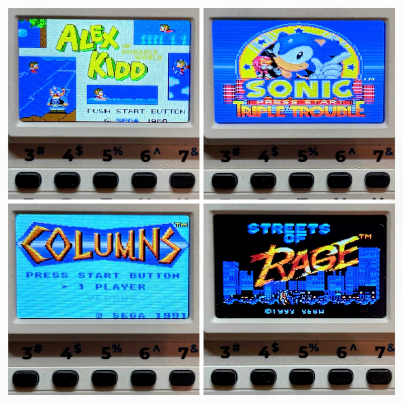
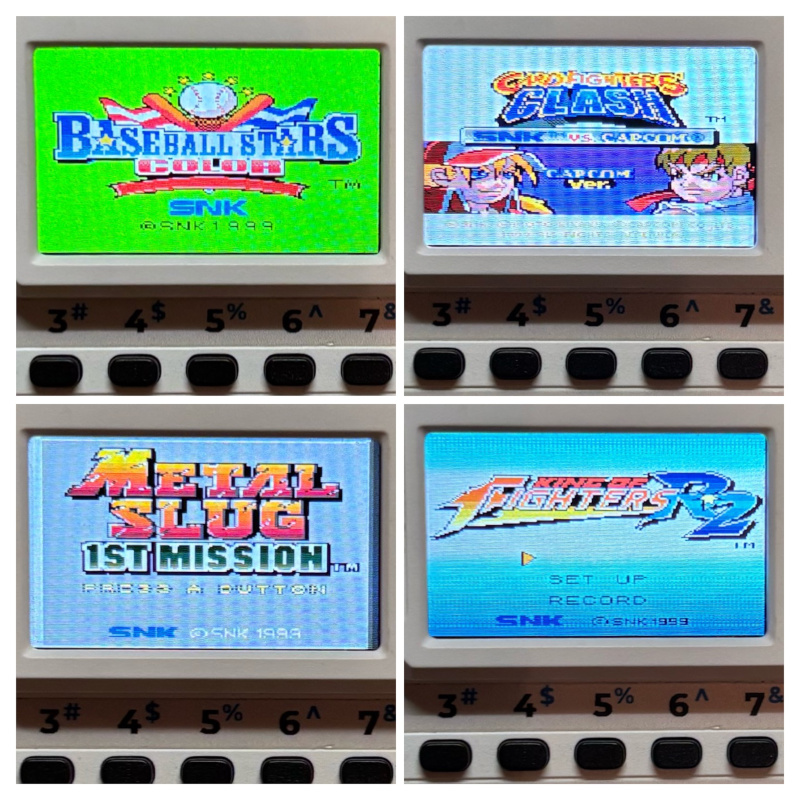
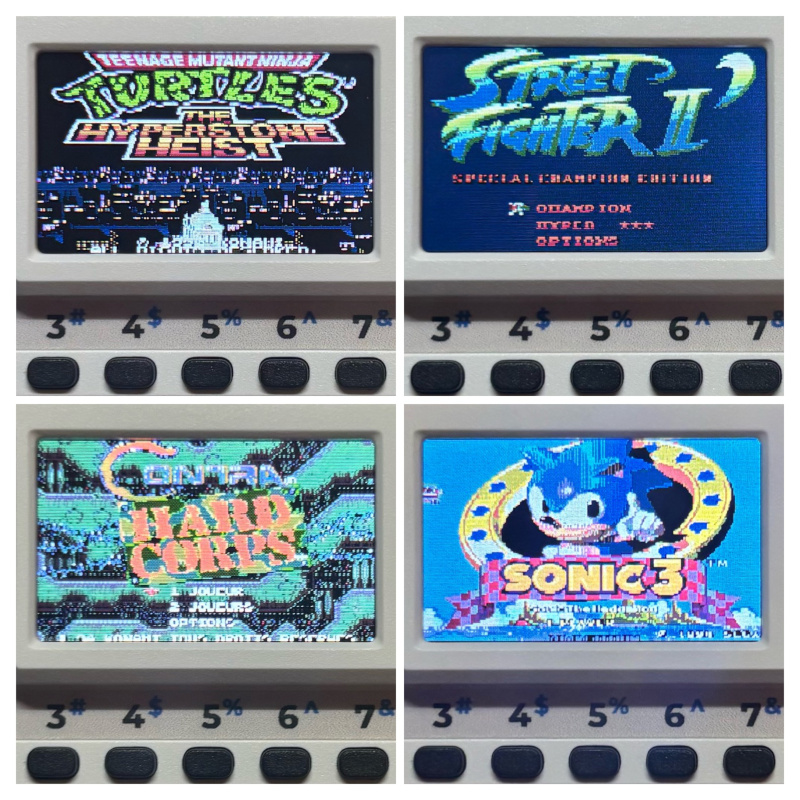

# Cardputer Game Station

Powered by [Nofrendo](https://github.com/moononournation/arduino-nofrendo), **Smsplus**, [Race](https://github.com/libretro/RACE) and [Gwenesis](https://github.com/bzhxx/gwenesis). 

**Running on the M5Stack Cardputer**, with sound, video, save, and gamepad controls.

- **NES**
- **Master System**
- **Game Gear**
- **Megadrive / Genesis**
- **Neo Geo Pocket Color**

It runs **`.nes` `.sms` `.gg`  `.md` `.ngc` ROM files directly from the SD**, simply browse and select the game you want to play.
**Make sure your ROMs are uncompressed** (.nes .gg .sms .ngc .md only — not .zip, .7z, or .rar).

**All games are supported**. 

Save files are stored on the SD card in the `nes_saves` or `sms_saves` (GG/SMS) folders.

## Controls

The built-in **Cardputer keyboard** is used for all controls: 

| Function | Cardputer Key | Description |
|---------------|---------------|-------------|
| 🕹️ Up | **E** | Move up |
| 🕹️ Down | **S** | Move down |
| 🕹️ Left | **A** | Move left |
| 🕹️ Right | **D** | Move right |
| 🅰️ Button A | **K** | Primary action / confirm |
| 🅱️ Button B | **L** | Secondary action / cancel |
| ▶️ Start | **1** | Start / pause |
| ⏸️ Select | **2** | Select / menu |
| 💡 Brightness + | **]** | Increase LCD brightness |
| 💡 Brightness − | **[** | Decrease LCD brightness |
| 🔊 Volume + | **+** | Increase audio volume |
| 🔊 Volume − | **-** | Decrease audio volume |
| 🖥️ Screen Mode | **\\** | Toggle screen display mode |
| 🔘 Quit Game | **G0 (hold 1 s)** | Go back to menu |

**Note:** `fn` + `arrows` keys are also binded for zoom/sound controls. The `j` key is also bound as Button A to allow an alternative layout for player preference.

## Zoom Mode

The Zoom Mode allows you to **dynamically adjust the display scale of games** on the Cardputer’s screen.

By pressing `\` (above the `OK` key), you can toggle between **multiple zoom levels (100 to 150%),  fullscreen or 4/3**. This flexibility ensures that each game looks its best on the Cardputer’s compact display.

You can precisely adjust the display zoom level with `fn` + `arrows left/right`.

✅ Why it matters:

- Enhances readability and visual comfort.
- Lets you adapt the screen to games.
- Greatly improves gameplay experience.

## About Games

All games  `.nes` `.gg` `.sms` `.md` `.ngc` should be **supported**. You can place the ROM files anywhere on your SD card and select them.

✅ Expected behavior:
- Smooth 60 FPS gameplay  
- Sound emulation  
- SD save/load functionality (NES, SMS, GG)

You can pick any file from your SD using the file browser. When browsing your game list, you can **type the first few letters of a game’s name** to jump directly to it. This makes it much faster to find a specific title, especially when your library contains dozens of entries. You should **avoid game titles longer than 64 characters**.